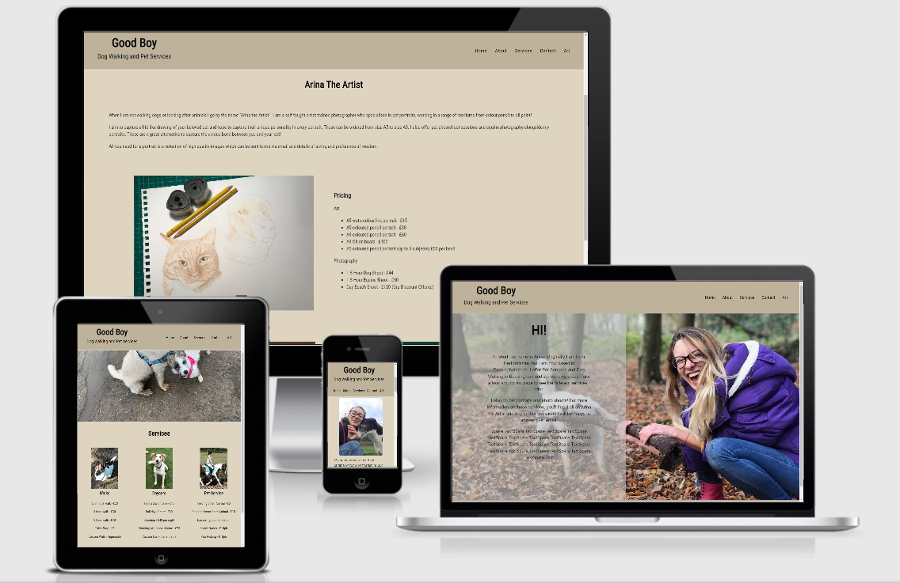
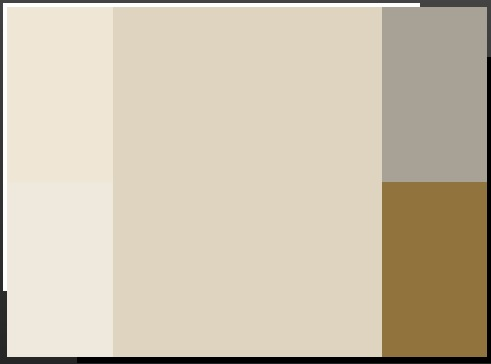

# Good Boy Dog Walking Pet Service

## Description
This is a repository which is created to showcase services offered. It gives a background and information on the person offering services in a clear and presise way. Features are laid out clearly and accessibly allowing free easy moving for users.
This can be seen here - [Click Here](https://ameliabultitude.github.io/MilestoneProjectOne/)

## UX

* This website is being created for a milestone project, I have come across bugs and slight errors which I have continued to work through. I am aiming to get a page done a day. I have been rewatching and listening to the lessons in this unit, I have also been looking over previous projects. For my user, I have maintained a clear and precise website structure. I would like my user to be able to perform actions to enable them to see the availability of the service.

## Design
### Color Scheme

This consists of BEB29B and the palet DFD7CB/DFD4C0. I used [ColorSchemeDesigner](https://colorschemedesigner.com/csd-3.5/) to allow me to see this palet.
* BEB29B used for the Header and Footer
* DFD7CB used for the background
* Font color all in black
* Roboto Condensed throughout the website
### Wireframe
This wireframe was created on [Figma](https://www.figma.com/) during my planning and designing process. 
I found [Figma](https://www.figma.com/) easy to use and very helpful to adjust my design if needed.
The main wireframe can be seen on this link [here]((https://www.figma.com/file/d0o10f4rwLb0JekvXAIbib/goodboy?node-id=0%3A1).

## Features
### Features Planned
* Documentation
* CSS/HTML Focus
* Color Scheme
* Color Scheme suitable for Color Blind Tests.
* Accessibility
* Responsive
* Bootstrap
  * Navbar
  * Grid Schemes
  * Buttons
  * Forms
* UX Elements
  * User Flow
  * Alignment
  * Images
* Interactive Gallery
* Multi Browser Functional
* Git - Version Control System
* GitHub - Remote Repository
* VS Code - External Respository
* Deployed - Hosted on Github Pages
### Features Implimented
* Documentation
* CSS/HTML Focus
* Color Scheme
* Accessibility
* Responsive Design
* Bootstrap
  * Grid Schemes
  * Buttons
  * Forms
* UX Elements
  * User Flow
  * Alignment
  * Images
* Git - Version Control System
* GitHub - Remote Repository
* VS Code - External Respository
* Deployed - Hosted on Github Pages
### Features left to Impliment
* Color Scheme suitable for Color Blind Tests.
* Interactive Gallery
* Multi Browser Functional

## Technology/Sites Used
* [HTML](https://en.wikipedia.org/wiki/HTML5)
  * HTML for strucutre
* [CSS](https://en.wikipedia.org/wiki/Cascading_Style_Sheets)
  * CSS for Styling
* [Google Chrome](https://www.google.com/chrome/)
    * Used for browser and dev tools
* [Mozilla Firefox](https://www.mozilla.org/en-US/firefox/new)
    * Used for browser and dev tools
* Apple Safari
  * Used for browser
* [Google](https://google.co.uk)
  * Google was used for research.
* [Bootstrap](https://getbootstrap.com/)
  * HTML and CSS Framework from Bootstrap
* [Visual Studio Code](https://code.visualstudio.com/)
  * This project was built using the VS Code IDE
* [GitHub](https://github.com/)
  * Repository hosted on GitHub
* [Github Pages](https://pages.github.com/)
  * Website hosted on Github Pages
* [Google Fonts](https://fonts.google.com/)
  * Imported Fonts
* [Font Awesome](https://fontawesome.com/)
  * Imported Icons
* [Slack](https://slack.com/intl/en-gb/)
  * Forum
* [Am I Responsive](http://ami.responsivedesign.is)
  * Testing responsiveness of the website

## Testing
Throughout my project, I put my site under lots of tests to ensure it worked correctly. The tests I ran are...
* Checking flow throughout the page with buttons in nav bar.
* Checking flow throughout the page with logo href.
* Checking my page was responsive throughout, on every device screen, portrait and landscape.
* Checking footer bar buttons href, linking to outer sites.
* Checking that my form has required settings and that it includes an email attribute.
* Checking every change made to the site in my IDE as I did it to ensure it was functional.
* Running site through HTML Validator and CSS Validator.

## Users
The expected audience of this site is clients wanting a service for their pet. It may be business men or woman who do not have enough time as they would like and need support in the day to day care of their animal to an elderly man or woman who would like some help. This page is user friendly for children and adults and is inviting for anybody who has an animal to learn more.
* A dog owner looking for a dog walking service
* A dog owner looking for holiday care
* A farm animal/equine owner looking for freelanced services
* An owner of an animal wanting a pet portrait

## User Scenarios
* A client would like to find the services offered
  * Finding the Services page and reading the services
* A client would like to know more information
  * Using the Keep in Touch page, comments and questions are able to be submitted with an email response back.
* A client would like a commission for a portrait
  * On the Art page, there is an email for contacting regarding portraits.

## Bugs during Development
### Bug
* Nav Items would not evenly space in Navbar
### Fix
* Padding was added into the nav items
### Verdict
* There is now even space between the items
### Bug
* Index background image height issue, cutting off sooner than the screen size
### Fix
* Using height and width of 100%, this bug was fixed easily
### Verdict
* The background image now covers well
### Bug
* Image one on about.html, on a smaller screen was not sitting on top of the text
### Fix
* Use of Bootstrap supported this fix
### Verdict
* The image now sits on top of the text 

## Deployment
The project is hosted on [GitHub Pages](http://github.com) and is written in [VS Code](https://code.visualstudio.com/)
### Process
* Create new repository using Code Institute Template
* Root Folder containing README.md and index.html
* Change source to master branch. (Or any desired branch)
* Provided link will be your projects index page.

To deploy your own version of the site:
* Have git installed
* Visit the repository
* Click 'Clone and copy the code for http
* Open your chosen IDE (VS Code, etc.)
* Open a terminal in your root directory
* Type 'git clone ' followed by the code taken from github repository clone
* Once this has finished you will have your own version of the website

During my development of this site, the code was written in VS Code then pushed onto Git Hub. I was able to see the changes and commits.
## Credits
### Media
* Media taken by [Arina Khanna](https://www.facebook.com/arinatheartist) with permission to use on the site.
### Content
* Form in Contact was taken and amended from Bootstrap
### Acknowledgements
* I received inspiration for this project from my friend who is starting her journey in creating a business at a young age.
* The Slack community helped me if I got stuck, there were a few people who gave me good pointers and kept pushing me forward
* Code Institute for teaching me what I know upto now in CSS and HTML.
